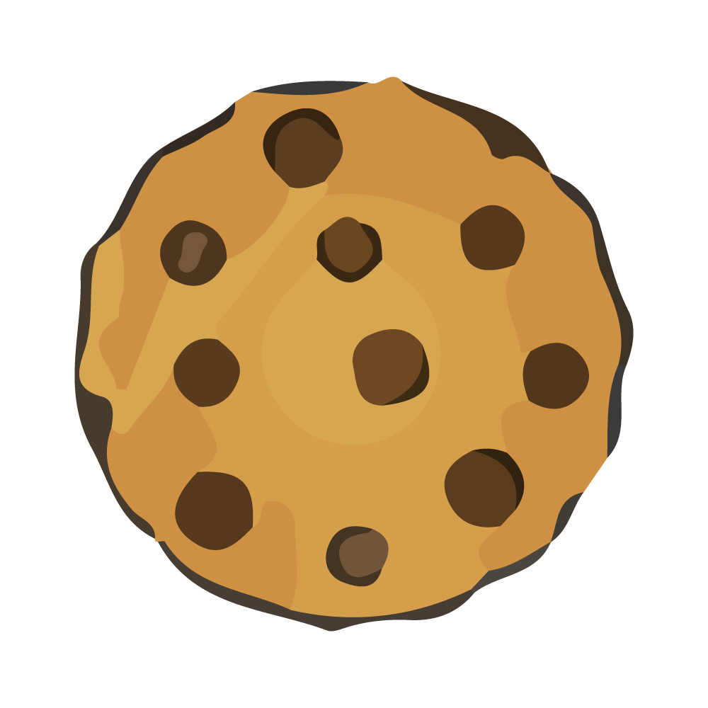
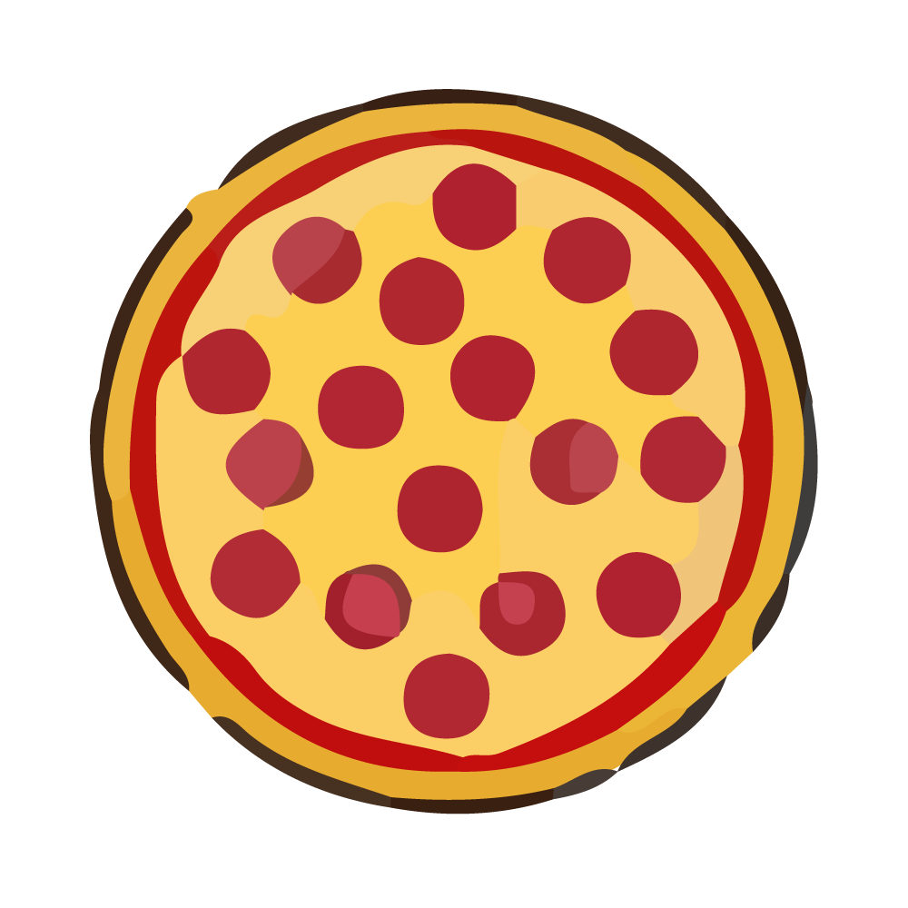
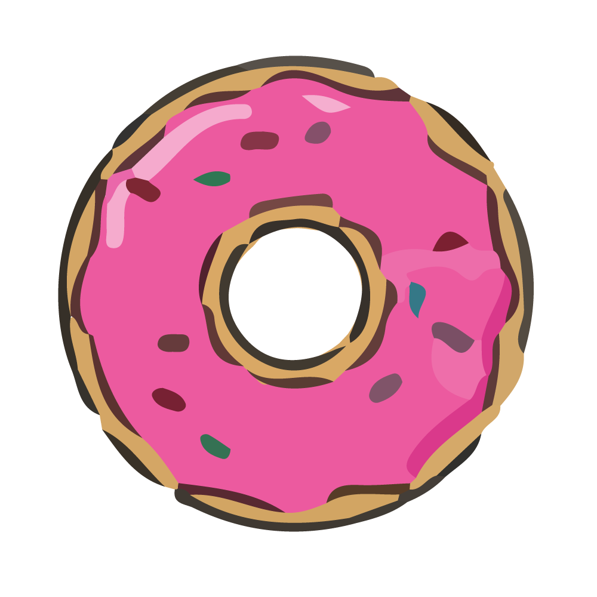
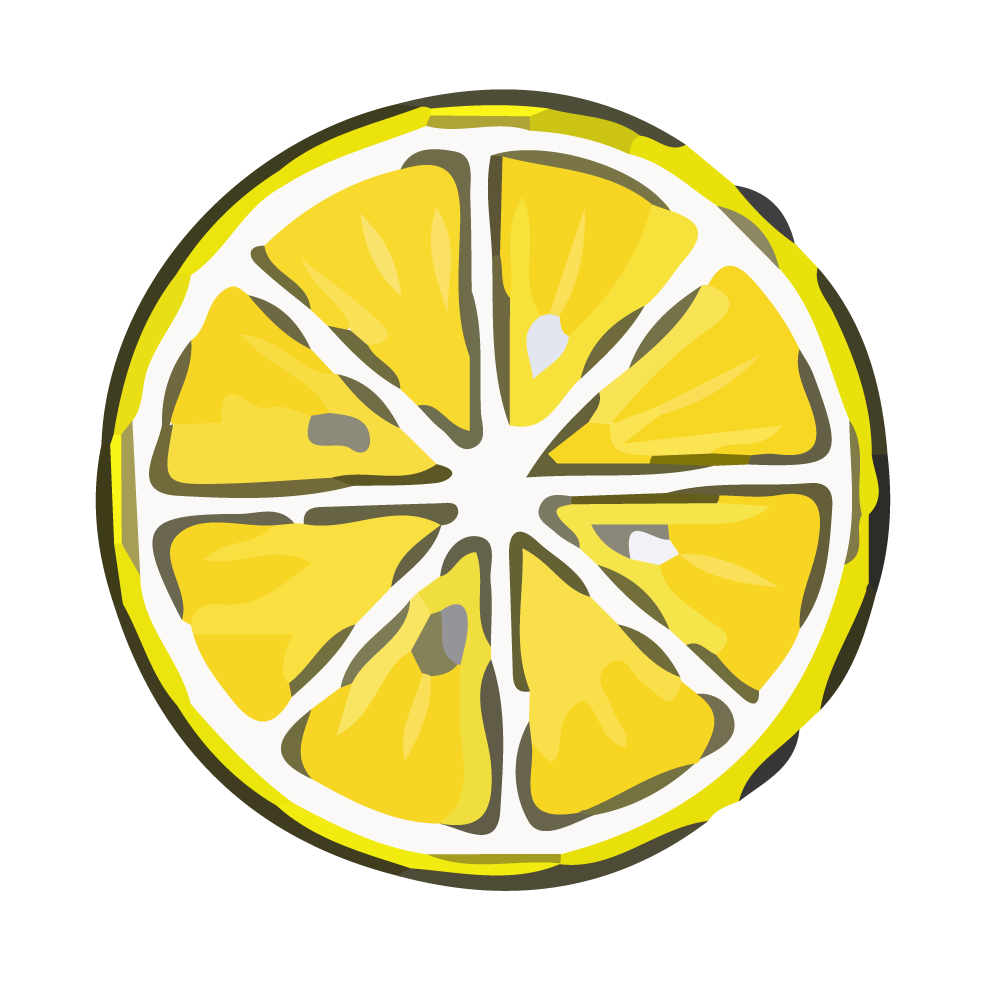

# Circle Of Food
This project renders parameterized images, and adjusts its own designs from these 4 inspiring images:
- Chocolate Chip Cookie

- Pepperoni Pizza

- Pink Donut

- Sliced Lemon

All 4 of these images were drawn in Illustrator which can be access via the assets folder. Their circular shapes and simplistic color schemes and patterns helps the generator to easily interpret them.

Since all 4 of the images are drastically different in color, each inspirations are varied as the generated circles are always changing in size, color, and location. Some of the generations resemble the inspired image more than the other depending on how much colors and patterns there are. Chocolate Chip Cookie resembles itself better than the Pink Donut.

Adjusting the mutation slider will help the rate of the exploration process.